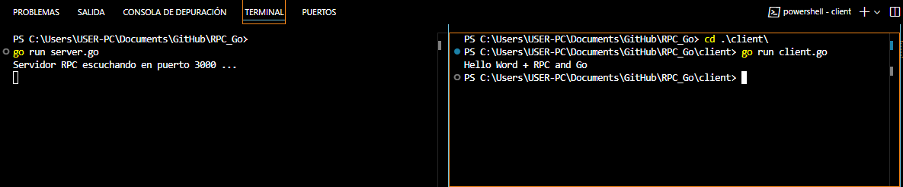

# 🌐 Go RPC Project: Hello World   

This project is a simple demonstration of **Remote Procedure Call (RPC)** in **Go**, implementing a basic client-server model. The server listens on port `3000` and provides a service to greet the user. The client sends a request with a argument to the server's method.



---

## 🚀 **Technologies Used**  
- **Programming Language**: Go  
- **Networking**: TCP for communication between client and server 

---

## 📖 **Prerequisites**  
Before running this project, ensure you have the following installed:  
1. **Go (Golang) 1.19 or later**  
2. **Git**  
3. A text editor such as **Visual Studio Code** (optional).  

---

## 🛠️ **Steps to Set Up and Run the Project**  

### 1️⃣ Clone the Repository  
Use the following command to clone the project from GitHub:  
```
git clone https://github.com/ciizao/RPC_Go.git
```
### 2️⃣ Navigate to the Project Directory
Move into the project directory where the server and client files are located.The server file is named server.go. Start the server by running the following command:
 ```
cd  RPC_Go
go run server.go
```
### 3️⃣ Run the Client
The client code is located in the client folder. Navigate to it and execute the client:
 ```
cd client
go run client.go
```
- * The client will send a request to the server and display the server's response

## 🔍 **Example Output**  

### **Server Output:**  
When the server is running, it will log the following upon receiving a request:  

`Server RPC listening on port 3000...`

### **Client Output:**  
When the client runs successfully, it will print:  

`Hello World + with RPC and Go`

## 📖 **How It Works**  

1. **Server:**
   - Listens on TCP port `3000`.
   - Provides an RPC service (`HelloService`) with the method `SayHello`, which takes a `Name` argument and returns a personalized greeting.

2. **Client:**
   - Connects to the server at `localhost:3000`.
   - Sends a request with a `Name` argument to the server's `SayHello` method.
   - Receives and prints the server's response.

3. **RPC Concept:**
   - Demonstrates **Remote Procedure Call (RPC)** where the client can call methods on the server as if they were local functions.

## 📂 Repository
* The source code for this project is available on GitHub:

```
https://github.com/ciizao/RPC_Go.git
```